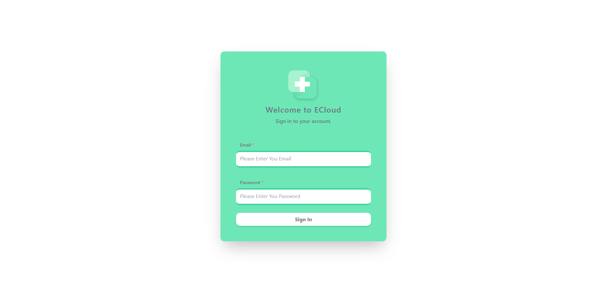
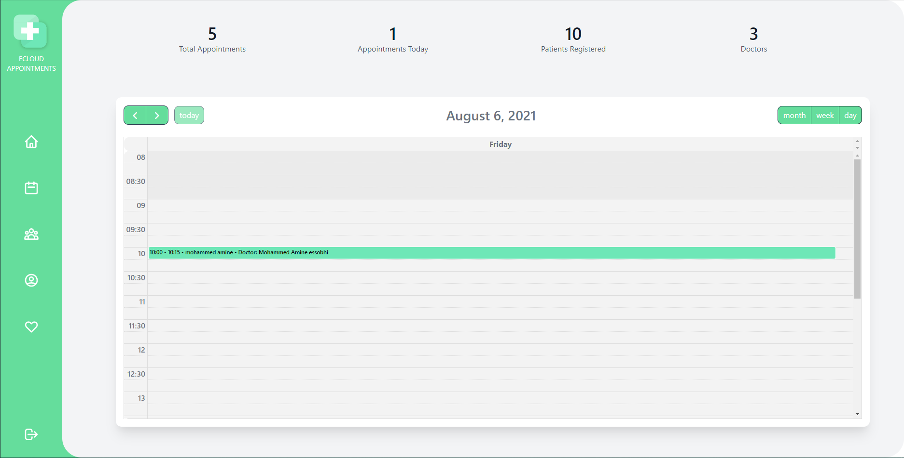
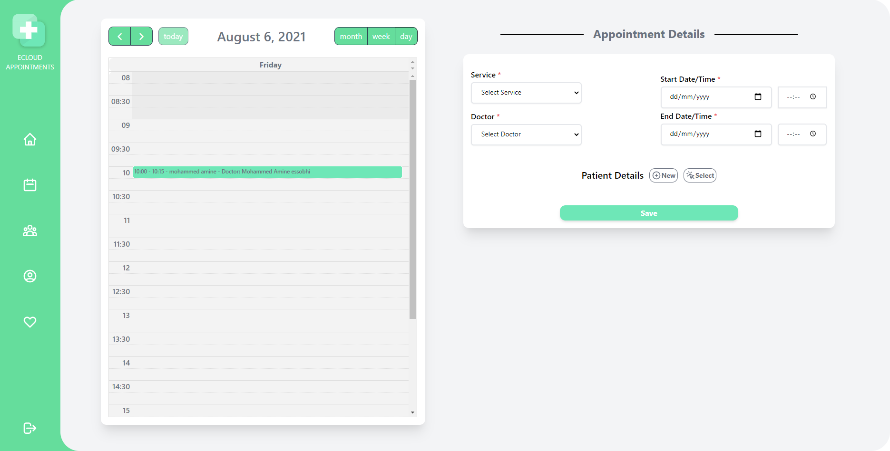
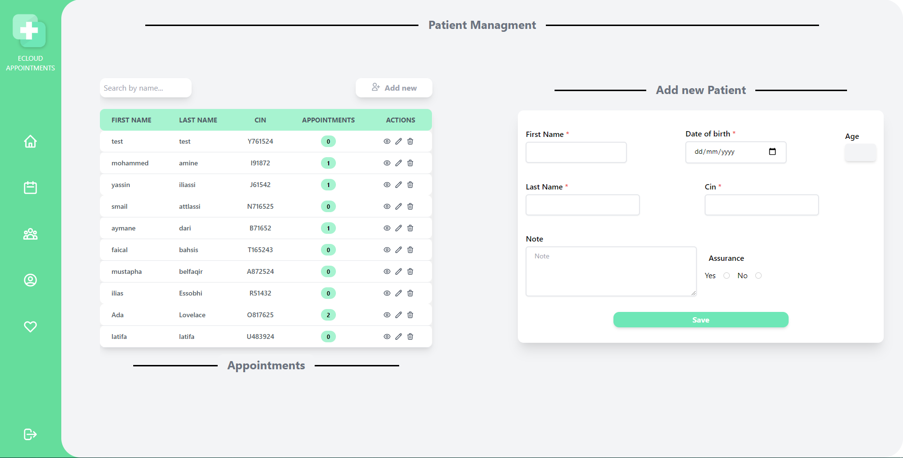

 
 

#Product definition

The project in general is a local web application that would replace traditional methods of booking appointments inside medical offices. The platform allows secretaries to manage patients and book appointments, and to easily organize schedules.

#Technical architecture

###LARAVEL

###Vue js

###mySQL

# Screenshots from the application

###LoginPage

###HomePage

###Appointments

###Patients management Page

# <a href= "https://docs.google.com/document/d/10oBW3X8WAPsGD9xTWBH_BDqWEWevMtQYoIMQmN2y-pU/edit?usp=sharing">Project Report
